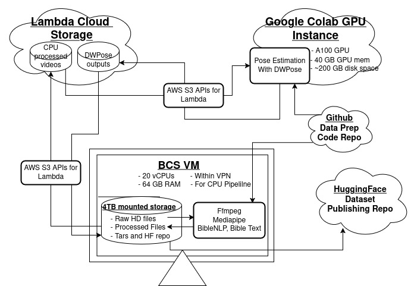

# ISL data accessing and processing 

ISL bible and dictionary data are made available by BCS. They are originally published on Youtube and distributed with a cc-by-sa licence.

Dataset Repo: https://huggingface.co/datasets/bridgeconn/sign-bibles-isl

Code Repo: https://github.com/BibleNLP/sign-bibles-dataset/ 

## The dataprocessing workflow 

**Input**: Raw HD videos of Sign Bibles and Dictionary from BCS studios.

**Processing**:
1. Down sample the input videos to lower resolution.Also trim the start and end of the videos to remove clapper board and idle pose.
2. Pose estimation using mediapipe.
3. Pose estimation using DWPose.
4. Add biblical metadata like verse reference range, list of BibleNLP vrefs and parallel Bible verse text(from BSB version).
5. Also add more video specific info to metadata like number of frames, fps, width, height etc.

**Outputs**:
For each sample:
1. mp4 video
1. .pose file
1. .npz file
1. transcript.json
1. .json

## How to prepare the dataset?
1. The raw data from BCS studios is shared as HD videos to us. It is about 2TB in size, for the 4 Gospels. And is shared on a BCS-VM. See [How to connect to BCS-VM](./docs/HOWTO-connect-BCS-VM.md). 
1. The first part of the dataset preparation is running the CPU-pipeline. It down samples the resolutions, trims the video, runs mediapipe pose estimation and gets metadata like BibleNLP vrefs, verse text etc. See [How to run the CPU-pipeline](./docs/HOWTO-run-CPU-pipline-on-BCS-VM.md).
1. The next part of the processing requires GPU. For transfering the data on the BCS-VM to a cloud GPU instance we need an intemediate storage solution. Lambda cloud filesystems are used for it now. See [How to avail a lambda filesystem](./docs/HOWTO-avail-lambda-fs.md).
1. Google colab pro account is used for running the GPU requiring parts of the data-processing pipelines. See [note on running the pipeline](./docs/HOWTO-run-GPU-pipline-on-colab.md)  and [the notebook]().
1. Once all the data files are prepared they are to be packaged in the format needed for a webdata set and published via Hugging Face repo. See [How to prepare webdataset](./docs/HOWTO-create-webdataset.md).

