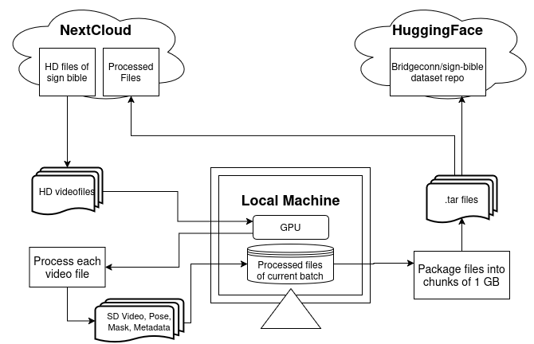

# ISL data accessing and processing 

ISL bible and dictionary data are made available by BCS. They are originally published on Youtube and distributed with a cc-by-sa licence.

## Setup and run

Follow the below installations and configurations.

### Install ffmpeg

```bash
sudo apt-get install ffmpeg
```

### Setup DWPose

```bash
git clone https://github.com/IDEA-Research/DWPose.git
wget -O DWPose/ControlNet-v1-1-nightly/models/control_v11p_sd15_openpose.pth https://huggingface.co/lllyasviel/ControlNet-v1-1/blob/main/control_v11p_sd15_openpose.pth
wget -O DWPose/ControlNet-v1-1-nightly/models/v1-5-pruned.ckpt https://huggingface.co/stable-diffusion-v1-5/stable-diffusion-v1-5/blob/main/v1-5-pruned.ckpt
gdown --id 12L8E2oAgZy4VACGSK9RaZBZrfgx7VTA2 -O DWPose/ControlNet-v1-1-nightly/annotator/ckpts/dw-ll_ucoco_384.onnx
gdown --id 1w9pXC8tT0p9ndMN-CArp1__b2GbzewWI -O DWPose/ControlNet-v1-1-nightly/annotator/ckpts/yolox_l.onnx
```

The full path to the annotator folder should be updated in the file `DWPose/ControlNet-v1-1-nightly/annotator/dwpose/wholebody.py`. 

The path to where `DWPose/ControlNet-v1-1-nightly` folder is added to `.env` file as `DWPOSE_PATH`.


### Connection to S3 bucket
Set the following environment variables in the `.env` file.

```
AWS_ACCESS_KEY_ID
AWS_SECRET_ACCESS_KEY
BUCKET_NAME
```

### Install python dependencies
Good to install these in a virtual environment.

```bash
python -m venv ENV 
source ENV/bin/activate
pip install -r requirements.txt
```

### Run

#### For ISL Dictionary
Data comes from S3. It uses multi threading from within python.
```bash
python isl_dict_processing.py
```

#### For ISL Bible
* The processing is supposed to be run in batches, say one Book at a time.
* Data is in BCS Next cloud

1. Get list of videos in a book

Need to provide the **path to the book chapters** in the main function of the script.
Make sure to give the **start count** within the main funtion of the script. Say for the very first book, start with 0. Then for next book give starting as the next file count after the last file of first book.

```bash
python gospel_file_list.py > matthew_list.txt
```
The size of one batch should be decided based on the space available at local machine for holding all processed files and tars until upload.

2. Download and process files

The `isl_gospel_processing.py` script downloads each HD file, down samples it, generates pose, mask and metadata files for it. This script is run from a bash script to ensure parallel processing.

Edit the `run_parallel.sh` file with the file path to the list of **input videos** generated in step 1 and path to the **output folder**. If required, adjust the number of parallel jobs.

```
time(bash run_parallel.sh)
```

Expect several hours, even close to a day for processing one full book. The progess can be monitored at `log/success.log` and `log/fail.log`.



3. TAR files for Webdataset

To divide and package the whole processed data into chunks of tar files less than 1 GB as required for the Webdataset, set the input and output paths as well as tar file count start in the script and run
```bash
python make_tar_files.py
```

4. Upload to huggingface

Upload the prepared tar file to the huggingface repo https://huggingface.co/datasets/bridgeconn/sign-bible. Before uploading, ensure the numbering of tar files are not conflicting with existing files there. 

5. Test the Webdataset

Use `test_webdataset.py` to load the tar files from local path or huggingface and test.

6. Move the processed file

Move the tar files from local to a server space and also remove all the generated files of the book from local storage to make space for processing the next book/batch. Make note of last number of processed file and last number of tar file to set the counts correctly for next batch.

